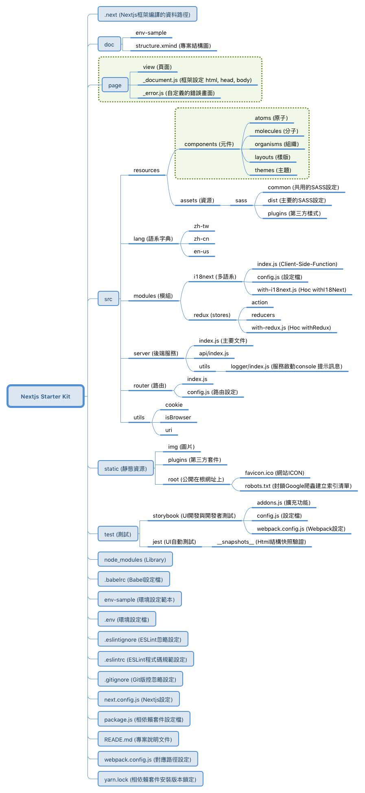

# Nextjs 5 Starter Kit

本開始模版，使用 Nextjs 5，並以我們常用的需求選取官方提供的範例，拼成一塊基礎的拼圖。

## Feature
- Server Side Render - Nextjs 5
- 多國語系 - i18next
- 程式碼品質
  - 團隊規範 ESLint
  - 元件測試 Jest
  - 確保邏輯異動為改變前端顯示樣式 Jest Snapshots
  - 增強型別 prop-types & Flow
- 樣式管理
  - 元件化樣式降低耦合與污染 Styled-component
  - 全域樣式 SCSS
  - 讀取進度條 nprogress
  - 元件開發 Storybook
- 狀態管理
  - Redux
- Serverless
  - 安全性套件 helmet
  - 後端渲染服務 Express
- 測試工具
  - 模擬API測試 json-server
  
  
## 注意事項
- 若非必要使用到 JQuery套件，盡量不使用JQuery，因為會影響到 Virtual DOM 判定進而影響渲染效能，ref 也避免使用（盡量）

## 專案結構
